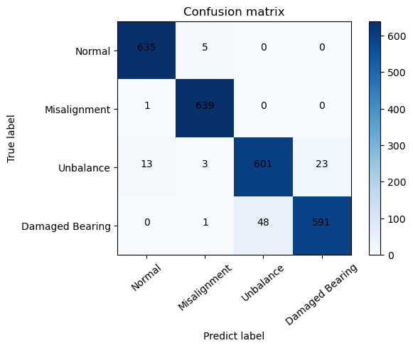

# Fault Diagnosis with Time-Domain Vibration Data
This repository aims to diagnose types of faults based on time-domain vibration data using neural networks. It covers experiments conducted with the Multi-Scale CNN-LSTM and Temporal Convolution Network-LSTM models.

## Experimental Setup
- 4 DC Motors
    - Normal | Misalignment | Unbalance | Damaged Bearing
- 26.5kHz Sampling Rate
- Raspberry PI DAQ Hats MCC172
- Data Collection: 102400 samples every 5 seconds

## Dependencies
Version of libraries may not make a problem except tensorflow.
- tensorflow == 2.9.0
- scikit-learn == 1.0.2
- numpy == 1.21.6
- scipy == 1.9.1
- matplotlib == 3.5.2

## Temporal Convolution Network-LSTM
The TCN implementation is based on @philipperemy's work (https://github.com/philipperemy/keras-tcn).

The TCN-LSTM architecture is created by myself.

  
  TCN Framework 

- input shape: (, 800)
- Train data: 13639
- Validation data: 3410
- Test data: 1895

## Experimental results

Even if the accuracy for sampling points is not 100%, with a total of over 100,000 data points available for real-time diagnosis, the final fault diagnosis is determined based on the majority of predictions obtained during real-time diagnosis. In the experimental environment, as mentioned earlier, the test results confirmed successful fault type diagnosis.

### TCN-LSTM

- Test datasets = 1895
- ROC AUC = 0.995
- F1 Score = 0.9857519788918205
- Accuracy = 98.575 %

  
   TCN Confusion matrix 

